# Overview

The Operation Cache controller is responsible for the following tasks:

- Provisioning the resources for the user.
- Pre-Provsion the resources for future use(Cache).
- Managing the lifecycle of the resources and cache

## The Interaction between User and Operation Cache Controller

``` mermaid

---
title: "Operation Cache Controller Context Diagram"
---
graph TD

usr["🧑‍💻 User"]

registry["📦 Image Registry
[Service]"]

requirement["📄 Requirement Spec"]
deployctl["🦾 deployctl
[Binary]"]

deploy-controller["⚙️ Operation Cache Controller Manager
[K8S Operator]"]

deploy["🖥️ Resources
[Resource]"]

deploy-cache["🖥️ Cached Resources
[Resource]"]

usr -- "Acquire resource" --> deployctl
usr -- "Push provisioner image to" --> registry

deployctl <-- "Create a spec of requested resources" --> requirement
deploy-controller <-- "reconcile" --> requirement
deployctl -- "Return a OperationID" --> usr

deploy-controller -- "Provision/Teardown" ---> deploy
deploy-controller -- "Manage lifecycle of" ---> deploy-cache

classDef focusSystem fill:#1168bd,stroke:#0b4884,color:#ffffff
classDef supportingSystem fill:#666,stroke:#0b4884,color:#ffffff
classDef user fill:#08427b,stroke:#052e56,color:#ffffff

class usr user
class deploy-controller,deployctl,requirement focusSystem
class registry supportingSystem
```



## Interactions between Operation Cache Controller Components

The detailed interaction of Operation Cache Controller components is as follows:

- The Operation Cache controller comsumes Requirement CRD and return the Operation ID which is used to indicate the resources are provisioned.
- The Operation Reconciler will create the Cache CRD and Operation CRD based on spec in Operation CRD
- The Cache CRD is used to store the pre-provisioned resources. It will create Operation CRs to provision the resources.
- The AppDeployment CRD is used to create the Provision and Teardown Job that doing the actual provisioning and teardown of the resources.

```mermaid
---
title: "Operation Cache Controller Interaction"
---

graph TD
requirement-crd["📜 Requirement Spec"]
subgraph deploy-controller["Operation Cache Controller"]
  operation-crd["📜 Operation Spec"]
  app-deployment-crd["📜 AppDeployment Spec"]
  cache-crd["📜 cache Spec"]

  requirement-rc["♻️ Requirement Reconciler
  [K8S Controller]"]
  operation-rc["♻️ Operation Reconciler
  [K8S Controller]"]
  cache-rc["♻️ Cache Reconciler
  [K8S Controller]"]
  app-deployment-rc["♻️ App Deployment Reconciler
  [K8S Controller]"]

  pj["🧑‍🔧 Provison Job
  [K8S Job]"]

  tj["🧑‍🔧 Teardown Job
  [K8S Job]"]
end

Resource["🖥️ Resources Provisioned
[Resource]"]

requirement-crd <-. "Reconcile" .-> requirement-rc

requirement-rc -- "Create" --> cache-crd
requirement-rc -- "Create" --> operation-crd

cache-crd <-. "Reconcile" .-> cache-rc
cache-rc -- "Create" --> operation-crd

operation-rc <-. "Reconcile" .-> operation-crd
operation-rc -- "Create/Delete" --> app-deployment-crd

app-deployment-rc <-. "Reconcile" .-> app-deployment-crd
app-deployment-rc -- "Create" --> pj
app-deployment-rc -- "Create" --> tj

pj -- "Provision" --> Resource
tj -- "Teardown" --> Resource

classDef focusSystem fill:#1168bd,stroke:#0b4884,color:#ffffff
classDef supportingSystem fill:#666,stroke:#0b4884,color:#ffffff
classDef user fill:#08427b,stroke:#052e56,color:#ffffff
classDef boundary fill:none,stroke:#666,stroke-dasharray:5,color:#ffffff

class deploy-controller boundary
class requirement-crd user
class operation-rc,app-deployment-rc,cache-rc,requirement-rc focusSystem
class cache-crd,operation-crd,app-deployment-crd,pj,tj supportingSystem
```



## The spec of CRDs that Operation Cache controller uses

### Requirement

```yaml
apiVersion: apps.devinfra.aks.goms.io/v1alpha1
kind: Requirement
metadata:
  name: my-requirement
spec:
  applications:
    - name: my-app-requirement-1
      image: my-image
      arguments: ["arg1", "arg2"]
      env:
        - name: MY_ENV
          value: my-value
    - name: my-app-requirement-2
      image: my-image-2
      arguments:
        - arg1
        - arg2
      env:
        - name: MY_ENV
          value: my-value-2
      dependencies:
        - my-app-requirement-1
  cachable: false
```

### Operation

```yaml
apiVersion: apps.devinfra.aks.goms.io/v1alpha1
kind: Operation
metadata:
  name: my-deploy-1
spec:
  applications:
    - name: my-app-1
      spec:
        image: my-image
        arguments: ["arg1", "arg2"]
        env:
          - name: MY_ENV
            value: my-value
    - name: my-app-2
      spec:
        image: my-image-2
        arguments:
          - arg1
          - arg2
        env:
          - name: MY_ENV
            value: my-value-2
      dependencies:
        - my-app-1
```

### AppDeployment

```yaml
kind: AppDeployment
metadata:
  name: my-operation-id-my-app-2
spec:
  opID: my-operation-id
  spec:
    image: my-image
    arguments: ["arg1", "arg2"]
    env:
      - name: MY_ENV
        value: my-value
  dependencies:
    - my-app-1
```

### Cache

```yaml
kind: Cache
metadata:
  name: my-cache-a31acb88
spec:
  applications:
    - name: my-app-1
      spec:
        image: my-image
        arguments: ["arg1", "arg2"]
        env:
          - name: MY_ENV
            value: my-value
    - name: my-app-2
      spec:
        image: my-image-2
        arguments:
          - arg1
          - arg2
        env:
          - name: MY_ENV
            value: my-value-2
      dependencies:
        - my-app-1
  CacheID: a31acb88138b21b131b331231131287
  CacheDuration: 2h
  AutoCount: true
```
